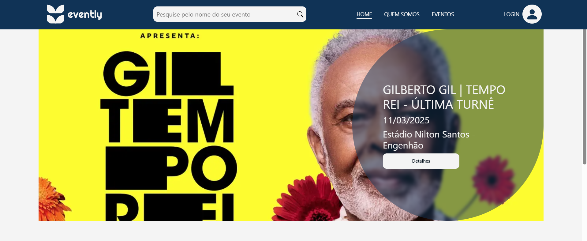

# 🎉Evently

## 📌 Sobre o Projeto

> Plataforma para gerenciamento de eventos, permitindo a criação, edição e inscrição em eventos.
>
> A plataforma foi desenvolvido com intuito de mostrar meu conhecimento com as tecnologias ultilizadas.



## 🚀 Tecnologias Utilizadas

- [AOS](https://michalsnik.github.io/aos/)
- [Axios](https://axios-http.com/ptbr/docs/intro)
- [Bootstrap Icons](https://icons.getbootstrap.com/)
- [EmbEmbla Carousel](https://www.embla-carousel.com/)
- [Node e NPM](https://nodejs.org/en/)
- [React](https://reactjs.org)
- [NextAuthJs](https://next-auth.js.org/)
- [NextJs](https://nextjs.org)
- [React Bootstrap](https://react-bootstrap.netlify.app/)
- [React Toastify](https://fkhadra.github.io/react-toastify/introduction)
- [React Hook Form](https://www.react-hook-form.com/)
- [Styled Components](https://styled-components.com)
- [Zustand](https://zustand-demo.pmnd.rs/)
- [Zod](https://zustand-demo.pmnd.rs/)

## 📦 Instalação e Configuração

Instruções de como rodar o projeto:

1. Clone o projeto em sua maquina seguindo o modo que você achar melhor;
2. Instale as dependências:

   ```sh
       npm install
   ```

3. Configure as variáveis de ambiente ``.env``:
    Crie um arquivo .env na raiz do projeto e adicione:
   ```env
        NEXTAUTH_URL=http://localhost:3000
        AUTH_SECRET="Sua Chave aqui"
   ```

4. Inicie o servidor de desenvolvimento:

    ```sh
       npm run dev
    ```

5. Seu projeto já deve está rodando em localhost.
> A api do projeto esta hospedada no render, sendo assim, pode ter delay para carregar. 

## 🖼️ Layout

O layout desenvolvido segue um [Figma](https://www.figma.com/design/uobQsGZhIAQFPN4EsWzeN6/Evently?node-id=0-1&t=OYkBfesu7Q4vw6fc-1) disponibilizado pela por mim. 

## 🚀 Deploy

O projeto utiliza o deploy da [Versel](https://vercel.com), para visualizar o mesmo, por favor [clique aqui!](https://evently-hub.vercel.app/)

## 📝 Licença

[MIT License](https://github.com/RayaniGomes/Evently/blob/main/LICENSE) © [Rayani Gomes](https://github.com/RayaniGomes)
